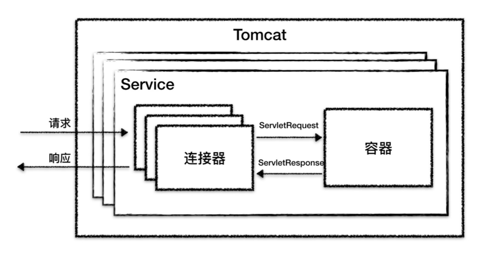
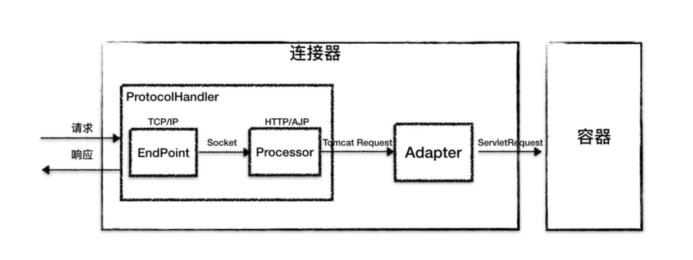
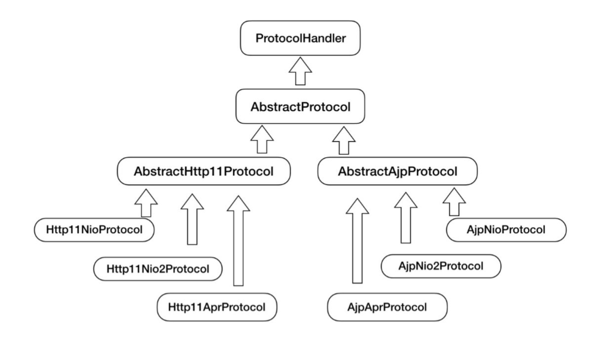
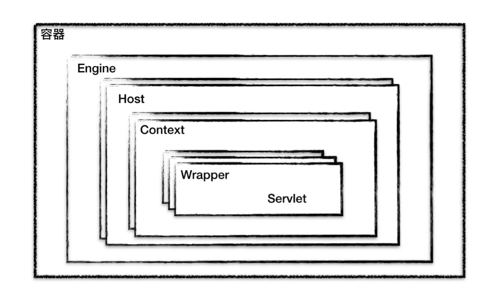
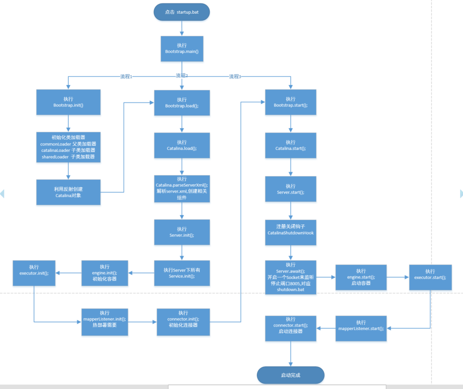

##tomcat总体架构
###web容器有两个核心的功能。
  1.接收用户请求（处理socket连接，将网络字节流与Request和Response转换）。<br>
  2.处理用户请求（处理转化的Request请求）。<br>

tomcat分别设计了两个核心组件来完成这两件事，**连接器和容器**。连接器负责对外交流，容器负责内部处理。<br>



##连接器

###tomcat支持的网络协议与I/O模型
tomcat支持多种网络协议和多种I/O模型，I/O模型和网络协议可以随机组合。
<br>
**Tomcat支持的 I/O 模型**<br>
NIO：非阻塞 I/O，采用 Java NIO 类库实现。<br>
NIO2：异步 I/O，采用 JDK 7 新的 NIO2 类库实现。<br>
APR：采用 Apache 可移植运行库实现，是 C/C++ 编写的本地库<br>
**Tomcat 支持的应用层协议**<br>
HTTP/1.1：这是大部分 Web 应用采用的访问协议。<br>
AJP：用于和 Web 服务器集成（如 Apache）。<br>
HTTP/2：HTTP 2.0 大幅度的提升了 Web 性能。<br>

###连接器的作用
1.监听网络端口<br>
2.接收网络连接请求<br>
3.读取网络请求字节流<br>
4.根据使用的应用层协议解析字节流，统一生成Tomcat Request对象。<br>
5.将Tomcat Request对象转化成标准的ServletRequest对象。<br>
6.调用Tomcat容器，得到ServletResponse对象。<br>
7.将ServletResponse转化成Tomcat Response对象。<br>
8.将Tomcat Response对象转化成网络字节流。<br>
9.将网络字节流返回给浏览器。<br>

##连接器的核心功能
1.网络通信。<br>
2.应用层协议解析。<br>
3.Tomcat Request与ServletRequest、Tomcat Response与ServletResponse之间的转化。<br>

Tomcat 设计了连接器的三个核心组件来分别完成这三个核心功能。<br>
**Endpoint**<br>
EndPoint 是通信端点，即通信监听的接口，是具体的 Socket 接收和发送处理器，是对传 输层的抽象，因此 EndPoint 是用来实现 TCP/IP 协议的。<br>
EndPoint 是一个接口，对应的抽象实现类是 AbstractEndpoint，而 AbstractEndpoint 的具体子类，比如在 NioEndpoint 和 Nio2Endpoint 中，有两个重要的子组件： Acceptor 和 SocketProcessor。<br>
其中 Acceptor 用于监听 Socket 连接请求。SocketProcessor 用于处理接收到的 Socket 请求，它实现 Runnable 接口，在 Run 方法里调用协议处理组件 Processor 进行处理。为 了提高处理能力，SocketProcessor 被提交到线程池来执行。而这个线程池叫作执行器 （Executor)。<br>

**Processor**<br>
如果说 EndPoint 是用来实现 TCP/IP 协议的，那么 Processor 用来实现 HTTP 协议， Processor 接收来自 EndPoint 的 Socket，读取字节流解析成 Tomcat Request 和
Response 对象，并通过 Adapter 将其提交到容器处理，Processor 是对应用层协议的抽象。<br>
Processor 是一个接口，定义了请求的处理等方法。它的抽象实现类 AbstractProcessor 对一些协议共有的属性进行封装，没有对方法进行实现。具体的实现有 AJPProcessor、 HTTP11Processor 等，这些具体实现类实现了特定协议的解析方法和请求处理方式。<br>

**Adapter**<br>
ProtocolHandler 接口负责解析请求并生成 Tomcat Request 类。但是这个 Request 对象不是标准的 ServletRequest，也就意味着，不能用 Tomcat Request 作为参数来调用容器。Tomcat 设计者的解决方案是引入 CoyoteAdapter，这是适配器模式的经典运用，连接器调用 CoyoteAdapter 的 Sevice 方
法，传入的是 Tomcat Request 对象，CoyoteAdapter 负责将 Tomcat Request 转成 ServletRequest，再调用容器的 Service 方法。

Tomcat 将网络通信与协议解析放到一起，为了封装网络协议与I/O模型可随机组合的变化，设计了一个ProtocolHandler的接口。
ProtocolHandler已经包含了Endpoint和Processor。<br>

**tomcat连接器关系图**<br>

**protocolHandler继承关系图**<br>


##容器

###容器的作用
负责加载和管理Servlet，接收连接器传递过来的ServletRequset请求，交给具体Servlet处理，并且将处理结果通过ServletResponse返回。<br>

###容器的层次结构
Tomcat设计了4种容器，Engin、Host、Context、Wrapper，容器之间是父子关系。<br>

Context 表示一个 Web 应用程序；Wrapper 表示一个 Servlet，一个 Web 应用程序中可能会有多个Servlet；Host 代表的是一个虚拟主机，或者说一个站点，可以给 Tomcat 配 置多个虚拟主机地址，而一个虚拟主机下可以部署多个 Web 应用程序；Engine 表示引擎，用来管理多个虚拟站点，一个 Service 最多只能有一个 Engine。<br>
每个容器都实现了同一个接口Container，Container又扩展了Lifecycle接口，Lifecycle的作用是用来管理容器的生命周期。<br>

```
public interface Container extends Lifecycle {    
    public void setName(String name);    
    public Container getParent();    
    public void setParent(Container container);   
    public void addChild(Container child);
    public void removeChild(Container child);    
    public Container findChild(String name); 
}

public interface Lifecycle {
    public void init();
    public void start();
    public void stop();
    public void destroy();
}

```

##tomcat启动流程
