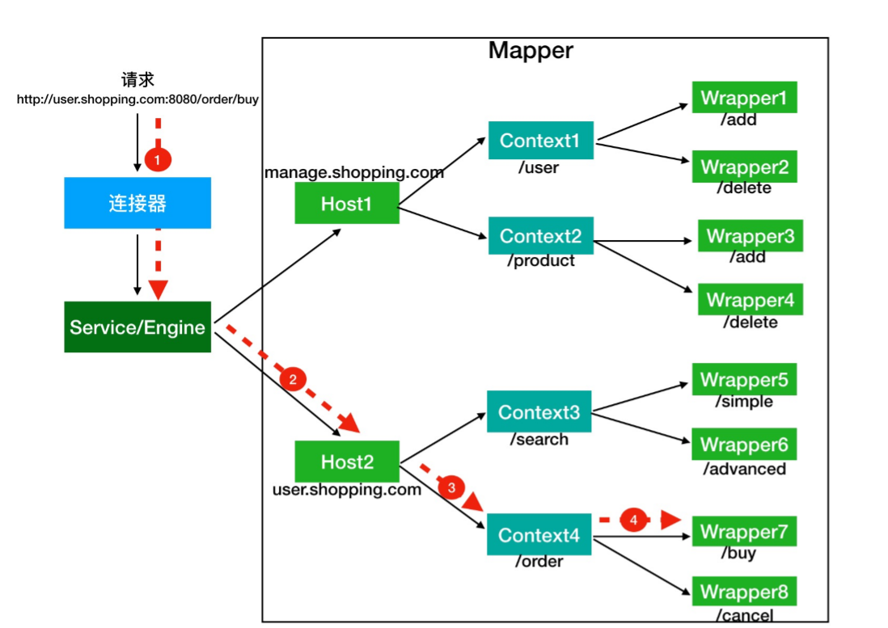
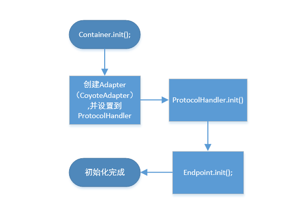
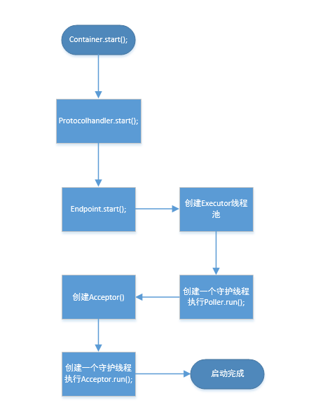

## Servlet规范与Servlet容器 <br>
### 什么是web容器 <br>
 web容器是 http服务器 与 Servlet容器 的组合。http负责接收和响应用户http请求，具体处理业务的流程交给servlet容器。<br>
 **Servlet 接口** <br>
 ```
public interface Servlet {    
    void init(ServletConfig config) throws ServletException;        
    ServletConfig getServletConfig();        
    void service(ServletRequest req, ServletResponse res）throws ServletException, IOException        
    String getServletInfo();      
    void destroy(); 
}
```
<br>
其中最重要是的 service 方法，具体业务类在这个方法里实现处理逻辑。<br>
这个方法有两个参数：ServletRequest 和 ServletResponse。ServletRequest 用来封装请求信息， <br>
ServletResponse 用来封装响应信息，因此本质上这两个类是对通信协议的封装。<br>
比如 HTTP 协议中的请求和响应就是对应了 HttpServletRequest 和 HttpServletResponse 这两个类。<br>
你可以通过 HttpServletRequest 来获取所有请求相关 的信息，包括请求路径、Cookie、HTTP 头、请求参数等。<br>
我们还可以通过 HttpServletRequest 来创建和获取 Session。而 HttpServletResponse 是用来封装 HTTP 响应的。<br>
你可以看到接口中还有两个跟生命周期有关的方法 init 和 destroy，<br>
Servlet 容器在加载 Servlet 类的时候会调用 init 方法，在卸载的时候会调用 destroy 方法。<br>
我们可能会在 init 方法里初始化一些资源，并在 destroy 方法里释放这些资源，<br>
比 如 Spring MVC 中的 DispatcherServlet，就是在 init 方法里创建了自己的 Spring 容器。<br>
ServletConfig 的作用就是封装 Servlet 的初始化参 数。<br>
可以在 web.xml 给 Servlet 配置参数，并在程序里通过 getServletConfig 方法拿到 这些参数。<br>
Servlet 规范提供了 GenericServlet 抽象类，我们可以通过扩展它来实现 Servlet。基于http协议的实现类HttpServlet。<br>
我们通过继承 HttpServlet 类来实现自己的 Servlet，只需要重写两个方法：doGet 和 doPost。<br> 

 ### 容器的扩展机制 Filter和Listener  <br>
 **Filter是过滤器**，这个接口允许你对请求和响应做一些统一的定制化处理。<br>
 过滤器的工作原理是这样的：Web 应用部署完成后，Servlet 容器需要实例化 Filter 并把 Filter 链接成一个 FilterChain。<br>
 当请求进来时，获取第一个 Filter 并调用 doFilter 方法，doFilter 方法负责 调用这个 FilterChain 中的下一个 Filter。<br>
 **Listener是监听器**，当 Web 应用在 Servlet 容器中运行时，Servlet 容器内部会不断的发生各种事件，如 Web 应用的启动和停止、用户请求到达等。<br>
 Servlet容器提供了一些默认的监听器来监听这些事件，当事件发生时，Servlet 容器会负责调用监听器的方法。<br>
 可以定义自己的监听器去监听你感兴趣的事件，将监听器配置在 web.xml 中。比如 Spring 就实现了自己的监听器，来监听 ServletContext 的启动事件， <br>
 目的是当 Servlet 容器启动时，创建并初始化全局的 Spring 容器。<br>
 
##  tomcat总体架构 <br>
###  web容器有两个核心的功能 <br>
  1.接收用户请求（处理socket连接，将网络字节流与Request和Response转换）。<br>
  2.处理用户请求（处理转化的Request请求）。<br>

tomcat分别设计了两个核心组件来完成这两件事，**连接器和容器**。连接器负责对外交流，容器负责内部处理。<br>


## 连接器 <br>

### tomcat支持的网络协议与I/O模型 <br>
tomcat支持多种网络协议和多种I/O模型，I/O模型和网络协议可以随机组合。
<br>
**Tomcat支持的 I/O 模型**<br>
NIO：非阻塞 I/O，采用 Java NIO 类库实现。<br>
NIO2：异步 I/O，采用 JDK 7 新的 NIO2 类库实现。<br>
APR：采用 Apache 可移植运行库实现，是 C/C++ 编写的本地库<br>
**Tomcat 支持的应用层协议**<br>
HTTP/1.1：这是大部分 Web 应用采用的访问协议。<br>
AJP：用于和 Web 服务器集成（如 Apache）。<br>
HTTP/2：HTTP 2.0 大幅度的提升了 Web 性能。<br>

### 连接器的作用 <br>
1.监听网络端口<br>
2.接收网络连接请求<br>
3.读取网络请求字节流<br>
4.根据使用的应用层协议解析字节流，统一生成Tomcat Request对象。<br>
5.将Tomcat Request对象转化成标准的ServletRequest对象。<br>
6.调用Tomcat容器，得到ServletResponse对象。<br>
7.将ServletResponse转化成Tomcat Response对象。<br>
8.将Tomcat Response对象转化成网络字节流。<br>
9.将网络字节流返回给浏览器。<br>

## 连接器的核心功能 <br>
1.网络通信。<br>
2.应用层协议解析。<br>
3.Tomcat Request与ServletRequest、Tomcat Response与ServletResponse之间的转化。<br>

Tomcat 设计了连接器的三个核心组件来分别完成这三个核心功能。<br>
**Endpoint**<br>
EndPoint 是通信端点，即通信监听的接口，是具体的 Socket 接收和发送处理器，是对传 输层的抽象，因此 EndPoint 是用来实现 TCP/IP 协议的。<br>
EndPoint 是一个接口，对应的抽象实现类是 AbstractEndpoint，而 AbstractEndpoint 的具体子类，比如在 NioEndpoint 和 Nio2Endpoint 中，有两个重要的子组件： Acceptor 和 SocketProcessor。<br>
其中 Acceptor 用于监听 Socket 连接请求。SocketProcessor 用于处理接收到的 Socket 请求，它实现 Runnable 接口，在 Run 方法里调用协议处理组件 Processor 进行处理。为 了提高处理能力，SocketProcessor 被提交到线程池来执行。而这个线程池叫作执行器 （Executor)。<br>

**Processor**<br>
如果说 EndPoint 是用来实现 TCP/IP 协议的，那么 Processor 用来实现 HTTP 协议， Processor 接收来自 EndPoint 的 Socket，读取字节流解析成 Tomcat Request 和
Response 对象，并通过 Adapter 将其提交到容器处理，Processor 是对应用层协议的抽象。<br>
Processor 是一个接口，定义了请求的处理等方法。它的抽象实现类 AbstractProcessor 对一些协议共有的属性进行封装，没有对方法进行实现。具体的实现有 AJPProcessor、 HTTP11Processor 等，这些具体实现类实现了特定协议的解析方法和请求处理方式。<br>

**Adapter**<br>
ProtocolHandler 接口负责解析请求并生成 Tomcat Request 类。但是这个 Request 对象不是标准的 ServletRequest，也就意味着，不能用 Tomcat Request 作为参数来调用容器。Tomcat 设计者的解决方案是引入 CoyoteAdapter，这是适配器模式的经典运用，连接器调用 CoyoteAdapter 的 Sevice 方
法，传入的是 Tomcat Request 对象，CoyoteAdapter 负责将 Tomcat Request 转成 ServletRequest，再调用容器的 Service 方法。

Tomcat 将网络通信与协议解析放到一起，为了封装网络协议与I/O模型可随机组合的变化，设计了一个ProtocolHandler的接口。
ProtocolHandler已经包含了Endpoint和Processor。<br>

**tomcat连接器关系图**<br>

**protocolHandler继承关系图**<br>


## 容器 <br>

### 容器的作用 <br>
负责加载和管理Servlet，接收连接器传递过来的ServletRequset请求，交给具体Servlet处理，并且将处理结果通过ServletResponse返回。<br>

### 容器的层次结构 <br>
Tomcat设计了4种容器，Engin、Host、Context、Wrapper，容器之间是父子关系。<br>

Context 表示一个 Web 应用程序；Wrapper 表示一个 Servlet，一个 Web 应用程序中可能会有多个Servlet；Host 代表的是一个虚拟主机，或者说一个站点，可以给 Tomcat 配 置多个虚拟主机地址，而一个虚拟主机下可以部署多个 Web 应用程序；Engine 表示引擎，用来管理多个虚拟站点，一个 Service 最多只能有一个 Engine。<br>
每个容器都实现了同一个接口Container，Container又扩展了Lifecycle接口，Lifecycle的作用是用来管理容器的生命周期。<br>

```
public interface Container extends Lifecycle {    
    public void setName(String name);    
    public Container getParent();    
    public void setParent(Container container);   
    public void addChild(Container child);
    public void removeChild(Container child);    
    public Container findChild(String name); 
}

public interface Lifecycle {
    public void init();
    public void start();
    public void stop();
    public void destroy();
}

```

### 容器如何定位Servlet<br>
容器通过Mapper组件根据用户访问的URL定位到一个Servlet。<br>
Mapper 组件里保存了 Web 应用的配置信息，其实就是容器组件与访问路径的映射关系， 比如 Host 容器里配置的域名、Context 容器里的 Web 应用路径，以及 Wrapper 容器里 Servlet 映射的路径，你可以想象这些配置信息就是一个多层次的 Map。<br>
<br>

假如有用户访问一个 URL，比如图中的 http://user.shopping.com:8080/order/buy，Tomcat 如何将这个 URL 定位到一 个 Servlet 呢？<br>
**首先，根据协议和端口号选定 Service 和 Engine。**<br>
我们知道 Tomcat 的每个连接器都监听不同的端口，比如 Tomcat 默认的 HTTP 连接器监 听 8080 端口、默认的 AJP 连接器监听 8009 端口。上面例子中的 URL 访问的是 8080 端 口，因此这个请求会被 HTTP 连接器接收，而一个连接器是属于一个 Service 组件的，这 样 Service 组件就确定了。我们还知道一个 Service 组件里除了有多个连接器，还有一个容 器组件，具体来说就是一个 Engine 容器，因此 Service 确定了也就意味着 Engine 也确定了。<br>
**然后，根据域名选定 Host。**<br>
Service 和 Engine 确定后，Mapper 组件通过 URL 中的域名去查找相应的 Host 容器，比 如例子中的 URL 访问的域名是user.shopping.com，因此 Mapper 会找到 Host2 这个
容器。<br>
**之后，根据 URL 路径找到 Context 组件。**<br>
Host 确定以后，Mapper 根据 URL 的路径来匹配相应的 Web 应用的路径，比如例子中访 问的是 /order，因此找到了 Context4 这个 Context 容器。<br>
**最后，根据 URL 路径找到 Wrapper（Servlet）。**<br>
Context 确定后，Mapper 再根据 web.xml 中配置的 Servlet 映射路径来找到具体的 Wrapper 和 Servlet。<br>

Tomcat容器之间是父子关系，当接收到一个ServletRquest会在容器之间传递，首先会经过Engin容器，再到Host容器，然后是Context容器，最后是Wrapper容器。<br>
每一层的容器都会对ServletRequest做一些处理，用到了责任链模式。具体的实现方式是使用了 Pipeline-Valve 管道。<br>


## tomcat启动流程 <br>


## 连接器初始化流程 <br>


## 连接器启动流程 <br>
